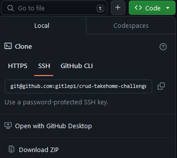

# CRUD back end takehome challenge

# Antonio Shivers

## How to run the server locally

1. Select the green "CODE" button and select either https, SSH, or GitHub CLI (whichever you prefer) and copy the url.

   

2. Open a terminal of your choosing and type: **git clone >the url you copied<**

3. cd into the newly cloned repo and type the command: **npm install**

4. Type the command: **npm start**

5. CONGRADULATIONS! You're now running the server locally.

### Methods + Routes supported

---

- GET / - Healthcheck

- GET /applications - GET all job applications

- GET /applications/:id - GET a job application by the ID

- POST /applications - POST a new job application

- PUT /applications/:id - UPDATE a job application

- DELETE /application/:id - DELETE a job application
